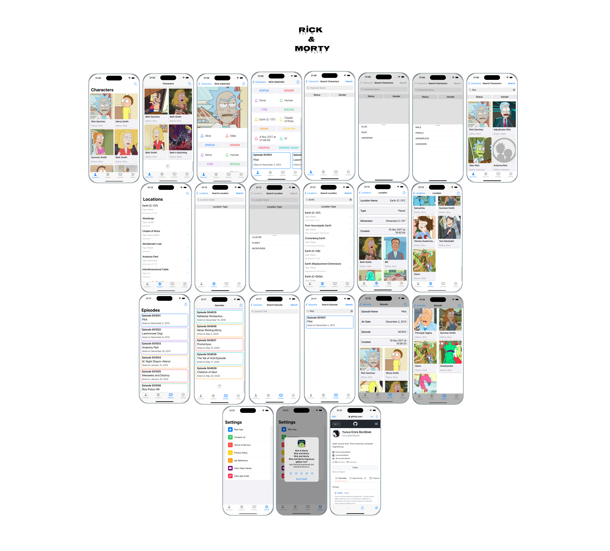

# Rick&Morty

## Built With
- [Swift](https://developer.apple.com/swift/)
- [UIKit](https://developer.apple.com/documentation/uikit)
- [API](https://rickandmortyapi.com)

  

## Overview
* Uses both UIKit and SwiftUI
* Designed with MVVM pattern
* No External Dependencies
* Pagination Support for data
* Auto layout Based
* Universal App: Run on iPhone, iPad, and Mac
* Leverages free Rick & Morty API

## Design
The app has five key area that we will build out step-by-step
1. Characters
2. Locations
3. Episodes
4. Settings
5. Search
